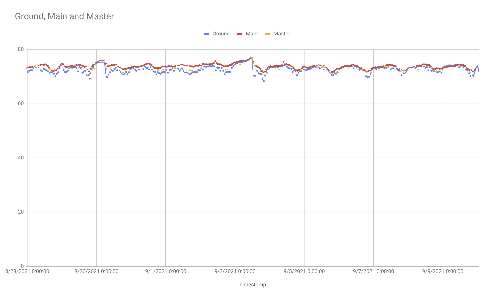

# nodehab

A thin expresjs & vue app wrapper around zwave-js for home automation with a Raspberry PI and a zwave dongle.
               
## installation

```sh
sudo apt-get install -y postgresql
git clone
npm install
```

Set environment variables needed by `database.json` or use a `.env` file.

## config format

```json
{
  "controllerAddress": "/dev/ttyUSB0",
  "networkKey": "DEADBEAFDEADBEAFDEADBEAFDEADBEAF",
  "nodes": {
    "2": "Master bath fan",
    "4": "Master bath sensor",
    "5": "Thermostat",
    "6": "Main bath fan",
    "16": "Back lock",
    "7": "Back Door",
    "19": "Garage Window",
    "18": "Deck sensor",
    "17": "Keg sensor",
    "15": "Front lock",
    "20": "Front door",
    "13": "Main bath sensor",
    "21": "Ground floor sensor"
  },
  "dashboard": [
    { "name": "Front lock", "driver": "zwave", "node": 15, "commandClass": 98, "endpoint": 0, "type": "switch", "read": "currentMode", "write": "targetMode",
      "trueValue": 255,
      "falseValue": 0
    },
    { "name": "Front door", "driver": "zwave", "node": 20, "commandClass": 48, "endpoint": 0, "type": "switch", "read": "Any",
      "trueValue": false,
      "falseValue": true
    },
    { "name": "Back lock", "driver": "zwave", "node": 16, "commandClass": 98, "endpoint": 0, "type": "switch", "read": "currentMode", "write": "targetMode",
      "trueValue": 255,
      "falseValue": 0
    },
    { "name": "Back door", "driver": "zwave", "node": 7, "commandClass": 48, "endpoint": 0, "type": "switch", "read": "Any",
      "trueValue": false,
      "falseValue": true
    },
    { "name": "Ground floor temp", "driver": "zwave", "node": 21, "commandClass": 49, "endpoint": 0, "type": "int", "read": "Air temperature" },
    { "name": "Garage window", "driver": "zwave", "node": 19, "commandClass": 48, "endpoint": 0, "type": "switch", "read": "Any",
      "trueValue": false,
      "falseValue": true
    },
    { "name": "A/C Mode", "driver": "zwave", "node": 5, "commandClass": 64, "endpoint": 0, "type": "radio",
      "read": "mode", "write": "mode",
      "options": [{"value": 0, "text":  "off"}, {"value": 1, "text": "heat"}, {"value": 2, "text": "cool"}]
    },
    { "name": "Main temp", "driver": "zwave", "node": 5, "commandClass": 49, "endpoint": 0, "type": "int", "read": "Air temperature" },
    { "name": "Main bath temp", "driver": "zwave", "node": 13, "commandClass": 49, "endpoint": 0, "type": "int", "read": "Air temperature" },
    { "name": "Main bath humidity", "driver": "zwave", "node": 13, "commandClass": 49, "endpoint": 0, "type": "int", "read": "Humidity" },
    { "name": "Main bath fan", "driver": "zwave", "node": 6, "commandClass": 37, "endpoint": 0, "type": "switch", "read": "currentValue", "write": "targetValue"},
    { "name": "Master bath temp", "driver": "zwave", "node": 4, "commandClass": 49, "endpoint": 0, "type": "int", "read": "Air temperature" },
    { "name": "Master bath humidity", "driver": "zwave", "node": 4, "commandClass": 49, "endpoint": 0, "type": "int", "read": "Humidity" },
    { "name": "Master bath fan", "driver": "zwave", "node": 2, "commandClass": 37, "endpoint": 0, "type": "switch", "read": "currentValue", "write": "targetValue"},
    { "name": "Deck temp", "driver": "zwave", "node": 18, "commandClass": 49, "endpoint": 0, "type": "int", "read": "Air temperature" },
    { "name": "Keg temp", "driver": "zwave", "node": 17, "commandClass": 49, "endpoint": 0, "type": "int", "read": "Air temperature" }
  ]
}
```

## example plugin
Add a file to `./plugins/`:

```javascript
module.exports = class KegHeater {
    constructor(driver, config) {
        this.driver = driver;
        this.config = config;

        const sensorId = parseInt(Object.keys(config.nodes).find(k => config.nodes[k] === 'Keg sensor'));
        const heaterId = parseInt(Object.keys(config.nodes).find(k => config.nodes[k] === 'Keg heater'));
        this.sensor = driver.controller.nodes.get(sensorId);
        this.heater = driver.controller.nodes.get(heaterId);

        console.log(`Keg sensor=${sensorId} heater=${heaterId}`);
    }

    async init() {
        const temp = await this.sensor.getValue({ commandClass: 49, property: 'Air temperature' });
        await this.update(temp);
    }

    async valueUpdated(node, args) {
        if(node.nodeId !== this.sensor.nodeId) return;
        if(args.commandClass !== 49) return;
        if(args.property !== "Air temperature") return;

        await this.update(args.newValue);
    }

    async update(temp) {
        const heating = await this.heater.getValue({ commandClass: 37, property: 'currentValue' });
        console.log(`Keg temp=${temp} heating=${heating}`);
        if(heating === false && temp < 32) {
            await this.heater.setValue({ commandClass: 37, property: 'targetValue' }, true);
            console.log(`Turned on keg heat`);
        }
        if(heating === true && temp > 36) {
            await this.heater.setValue({ commandClass: 37, property: 'targetValue' }, false);
            console.log(`Turned off keg heat`);
        }
    }
}
```

## creating migrations

```sh
npm run db-migrate -- create <my-name> --sql-file
```

## running migrations

```sh
npm run db-migrate -- up
```
                                              
## example reports

```sql
select slots.slot, ground.temp as ground, main.temp as main, master.temp as master
from ( select to_timestamp(floor((extract('epoch' from timestamp) / 600)) * 600) AT TIME ZONE 'UTC' as slot
         from events where node in (4, 13, 21) and property = '"Air temperature"' group by slot ) slots
left join ( select to_timestamp(floor((extract('epoch' from timestamp) / 600)) * 600) AT TIME ZONE 'UTC' as slot, avg("newValue"::float) as temp
        from events where node=21 and property = '"Air temperature"' group by slot ) ground on ground.slot = slots.slot
left join ( select to_timestamp(floor((extract('epoch' from timestamp) / 600)) * 600) AT TIME ZONE 'UTC' as slot, avg("newValue"::float) as temp
        from events where node=13 and property = '"Air temperature"' group by slot ) main on main.slot = slots.slot
left join ( select to_timestamp(floor((extract('epoch' from timestamp) / 600)) * 600) AT TIME ZONE 'UTC' as slot, avg("newValue"::float) as temp
        from events where node=4 and property = '"Air temperature"' group by slot ) master on master.slot = slots.slot
order by slots.slot;
```

Yields:


